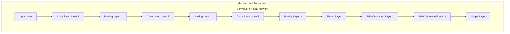

This Mermaid code represents a microservices architecture diagram for a convolution neural network. The architecture consists of several layers, including multiple convolution and pooling layers, followed by fully connected layers and an output layer.